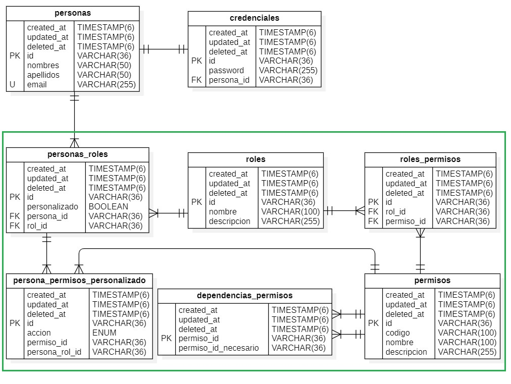

# **Documentación técnica: Módulos de autenticación y roles & permisos**

## Uso del proyecto para empezar un nuevo proyecto

### Proceso detallado para clonar y personalizar un proyecto NestJS

#### 1. **Clonar el repositorio base:**

```bash
git clone https://tu-repositorio/nestjs_backend_template nuevo-proyecto
```

- **`https://tu-repositorio/nestjs_backend_template`:** Reemplaza con la URL exacta de tu repositorio.
- **`nuevo-proyecto`:** El nombre que deseas asignar a tu nuevo proyecto.

#### 2. **Acceder al directorio del proyecto:**

```bash
cd nuevo-proyecto
```

#### 3. **Eliminar el repositorio remoto original:**

```bash
git remote remove origin
```

#### 4. **Agregar el nuevo repositorio remoto:**

```bash
git remote add origin https://tu-nuevo-repositorio.git
```

- **`https://tu-nuevo-repositorio.git`:** Reemplaza con la URL de tu nuevo repositorio en GitHub, GitLab o cualquier otra plataforma.

#### 5. **Buscar y reemplazar nombres:**

- **Utilizar un editor de código con búsqueda y reemplazo:** Herramientas como Visual Studio Code, Sublime Text o Atom ofrecen funciones de búsqueda y reemplazo global para encontrar y reemplazar todas las ocurrencias de un término en múltiples archivos.
- **Remplazamos:** Reemplazamos `nestjs_backend_template` por el nombre de tu nuevo proyecto, por ejemplo `nuevo-proyecto`.

#### 6. **Commit y push:**

No es necesario hacer el `git add .` ni el `git commit -m "Mensaje"` si no se realizo cambio antes de hacer el push.

```bash
git add .
git commit -m "Inicialización del proyecto [nuevo-proyecto]"
git push -u origin main
```

#### 7. **Instalar dependencias:**

Se instalan las dependencias del proyecto.

```bash
npm install
```

#### 8. **Configurar el archivo .env:**

- **Crear un archivo `.env`** si no existe.
- **Configurar las variables de entorno** según las necesidades de tu proyecto.

#### 9. **Iniciar el proyecto:**

```bash
npm run start:dev
```

## 1. Introducción

En esta sección se documentará la creación de dos módulos fundamentales para la aplicación:

> [**Módulo de autenticación**](#4-módulo-de-autenticación): Permite a los usuarios autenticarse mediante email y contraseña o Google.
>
> [**Módulo de roles y permisos**](#5-módulo-de-roles-y-permisos): Administra los roles de los usuarios y los permisos que estos poseen dentro de la aplicación.

Ambos módulos son esenciales para gestionar la seguridad y control de acceso de la aplicación, y comparten muchas librerías en común para la gestión de autenticación, validación y bases de datos.

## 2. Reglas y requisitos

### 2.1. Requisitos previos

- **Node.js** versión 16 o superior.
- **NestJS** como framework backend.
- **MySQL** como base de datos.
- **JWT** (JSON Web Tokens) para manejo de tokens de autenticación.
- **Google OAuth 2.0** para autenticación con Google.

### 2.2. Reglas generales

- **Autenticación**: Todo usuario debe autenticarse antes de acceder a recursos protegidos.
- **Roles y Permisos**: El acceso a ciertas partes de la aplicación se controlará mediante roles. Cada usuario puede tener uno o más roles, y cada rol tendrá permisos asignados.
- **Seguridad**: Las contraseñas serán almacenadas de forma segura mediante encriptación con bcrypt. Los tokens de acceso se gestionarán a través de JWT.

## 3. Instalación y Configuración de Librerías

Estas librerías son comunes a ambos módulos y permiten implementar funcionalidades de autenticación, seguridad, acceso a bases de datos, validación y configuración.

### 3.1. Librerías comunes

- **Autenticación y Seguridad**
  - **@nestjs/jwt**: Manejo de JWT.
  - **@nestjs/passport**: Integración de estrategias de autenticación.
  - **passport**: Biblioteca principal para autenticación.
  - **passport-google-oauth20**: Autenticación con Google.
  - **passport-jwt**: Estrategia para autenticación basada en JWT.
  - **passport-local**: Estrategia para autenticación con email y contraseña.
  - **bcrypt**: Encriptación de contraseñas.
- **Base de Datos y ORM**
  - **@nestjs/typeorm**: Integración de TypeORM con NestJS.
  - **typeorm**: ORM para interactuar con bases de datos.
  - **mysql2**: Cliente MySQL.
- **Validación y Transformación de Datos**
  - **class-validator**: Validación de datos.
  - **class-transformer**: Transformación de objetos.
- **Configuración y Variables de Entorno**
  - **@nestjs/config**: Manejo de configuración.
  - **dotenv**: Cargar variables de entorno.
  - **cookie-parser**: Manejo de cookies.
- **Correo Electrónico**
  - **@nestjs-modules/mailer**: Envío de correos electrónicos.
  - **@types/nodemailer**: Tipos para Nodemailer.

### 3.2. Instalación

Instala todas las librerías comunes de una vez:

```bash
npm install @nestjs/jwt @nestjs/passport passport passport-google-oauth20 passport-jwt passport-local bcrypt
npm install @nestjs/typeorm typeorm mysql2
npm install class-validator class-transformer
npm install @nestjs/config dotenv cookie-parser
npm install @nestjs-modules/mailer
npm install googleapis
```

Dependencias de desarrollo:

```bash
npm install --save-dev @types/passport @types/passport-google-oauth20 @types/passport-jwt @types/passport-local @types/bcrypt
npm install --save-dev @types/multer @types/cookie-parser @types/nodemailer
```

### 3.3. Configuración de Variables de Entorno

En la raíz del proyecto, crea un archivo .env para manejar las variables de entorno:

```bash
# BASE DE DATOS
DB_HOST=localhost
DB_PORT=3306
DB_LOCAL_PORT=3306
DB_USER=root
DB_PASSWORD=root
DB_NAME=your_database_name
DB_ROOT_PASSWORD=root

# APP
PORT=5000
APP_NAME=YourAppName
APP_ENV=development # development | production
SERVER_HOST=http://your_server_host:5000

# JWT
JWT_SECRET_KEY_ACCESS=your_jwt_secret_access_key # Generar una clave segura, para los tokens de acceso
JWT_SECRET_KEY_REFRESH=your_jwt_secret_refresh_key # Generar una clave segura, para los tokens de refresco
JWT_EXPIRES_IN_ACCESS=3h # Tiempo de expiración del token de acces
JWT_EXPIRES_IN_REFRESH=7d # Tiempo de expiración del token de refresco

# RUTAS Y DOMINIOS
FRONTEND_DOMAIN_ADMIN=localhost
FRONTEND_DOMAIN_CLIENT=localhost
FRONTEND_URL_ADMIN=http://localhost:4200
FRONTEND_URL_CLIENT=http://localhost:4201

# ROLES INICIALES
ROLE_ADMIN=admin
ROLE_USER=user

# USUARIO DEFAULT
DEFAULT_EMAIL=your_default_email@example.com
DEFAULT_PASSWORD=your_default_password

# OAUTH
OAUTH_CLIENT_ID=your_oauth_client_id # Google OAuth Client ID
OAUTH_CLIENT_SECRET=your_oauth_client_secret # Google OAuth Client Secret
OAUTH_REDIRECT_URI=http://localhost:5000/auth/google/callback # Google OAuth Redirect URI

# GMAIL
GMAIL_API_USER=your_gmail_address@example.com # Cuenta de Gmail para enviar correos
GMAIL_API_AUTHORIZATION_CODE=your_authorization_code # Código de autorización de Gmail
GMAIL_API_REFRESH_TOKEN=your_refresh_token # Token de refresco de Gmail
GMAIL_API_ACCESS_TOKEN=your_access_token # Token de acceso de Gmail
SUPPOR_EMAIL=your_support_email@example.com # Correo de soporte
```

Asegúrate de cargar estas variables en tu aplicación usando @nestjs/config:

```typescript
import { ConfigModule } from '@nestjs/config';
export const CONFIG = { isGlobal: true };
@Module({ imports: [ConfigModule.forRoot(CONFIG)] })
export class AppModule {}
```

## 4. Módulo de Autenticación

### 4.1. Generación del Módulo

Genera el módulo de autenticación usando el CLI de NestJS:

```bash
nest generate resource auth
? What transport layer do you use? REST API
? Would you like to generate CRUD entry points? No
```

### 4.2. Estructura de Carpetas

Dentro de la carpeta **auth/**, crea las siguientes subcarpetas:

- **config/:** Configuración de JWT y OAuth.
- **guards/:** Guards para proteger rutas.
- **interfaces/:** Definiciones de interfaces.
- **strategies/:** Estrategias de autenticación (JWT, Google).
- **utils/:** Utilidades varias.

### 4.3. Archivos de config

- **google-oauth.config.ts:** El archivo de configuración de Google OAuth, este archivo se encarga de leer las variables de entorno y exportarlas como un objeto.

```typescript
import { registerAs } from '@nestjs/config';

export default registerAs('googleOAuth', () => ({
  clinetID: process.env.OAUTH_CLIENT_ID,
  clientSecret: process.env.OAUTH_CLIENT_SECRET,
  callbackURL: process.env.OAUTH_REDIRECT_URI,
}));
```

- **jwt.config.ts:** El archivo de configuración de JWT, este archivo se encarga de leer las variables de entorno y exportarlas como un objeto.

```typescript
import { registerAs } from '@nestjs/config';
import { JwtModuleOptions } from '@nestjs/jwt';
export default registerAs(
  'jwt',
  (): JwtModuleOptions => ({
    secret: process.env.JWT_SECRET_KEY_ACCESS,
    signOptions: {
      expiresIn: process.env.JWT_EXPIRES_IN_ACCESS,
    },
  }),
);
```

### 4.4. Archivos de guards

- **google-auth/google-auth.guard.ts:** Este guardia se encarga de proteger las rutas que requieren autenticación con Google, usando la estrategia de autenticación de Google.

```typescript
@Injectable()
export class GoogleOauthGuard extends AuthGuard('google') {}
```

- **jwt-auth/jwt-auth.guard.ts:** Este guardia se encarga de proteger las rutas que requieren autenticación con JWT, usando la estrategia de autenticación de JWT. El JwtAuthGuard extiende de AuthGuard('jwt') y sobreescribe los métodos canActivate y handleRequest para personalizar la lógica de autenticación. Permite proteger rutas públicas y privadas. Además de verificar si es una petición de GraphQL o HTTP.

```typescript
@Injectable()
export class JwtAuthGuard extends AuthGuard('jwt') {
  constructor(
    private readonly reflector: Reflector,
    private readonly authService: AuthService,
  ) {
    super();
  }

  canActivate(
    context: ExecutionContext,
  ): boolean | Promise<boolean> | Observable<boolean> {}

  getRequest(context: ExecutionContext) {}

  handleRequest(
    err: any,
    user: any,
    info: any,
    context: ExecutionContext,
    status?: any,
  ) {}

  getIsPublic(context: ExecutionContext): boolean {}
}
```

### 4.5. Archivos de interfaces

- **auth.interface.ts:** Define las interfaces de Payload_Access, Payload_Refresh y AuthResponse. Se encuentra [src/auth/interfaces/auth.interface.ts](./src/auth/interfaces/auth.interface.ts).

### 4.6. Archivos de strategies

- **google.strategy.ts:** Estrategia de autenticación con Google, se encarga de validar el token de Google y devolver la información del usuario. Se encuentra [src/auth/strategies/google.strategy.ts](./src/auth/strategies/google.strategy.ts).
- **jwt.strategy.ts:** Estrategia de autenticación con JWT, se encarga de validar el token JWT y devolver la información del usuario. Se encuentra [src/auth/strategies/jwt.strategy.ts](./src/auth/strategies/jwt.strategy.ts).

### 4.7. Archivos de utils

- **constants.ts:** Define las constantes de JWT.

```typescript
export const jwtConstants = {
  secret: process.env.JWT_SECRET_KEY_ACCESS,
};
```

- **cookie.util.ts:** Define funciones de utilidad para manejar las cookies. Se encarga de limpiar y establecer las cookies de refresco de JWT. Se encuentra [src/auth/utils/cookie.util.ts](./src/auth/utils/cookie.util.ts).

### 4.8. AuthController

Esta clase se encarga de manejar las rutas de autenticación, como el inicio de sesión, registro, cierre de sesión y renovación de tokens. Se encuentra en [src/auth/auth.controller.ts](./src/auth/auth.controller.ts).

Cuenta con estos endpoints:

- **POST /auth/login:** Inicia sesión con email y contraseña.

  Llama al servicio `CredencialesService` para verificar las credenciales del usuario y devuelve tokens de acceso y de refresco.

- **POST /auth/login-admin:** Inicia sesión con email y contraseña para administradores.

  Similar a `/auth/login`, pero las cookies y permisos están configurados para el dominio del panel administrativo.

- **POST /auth/refresh-access-token:** Renueva el token de acceso utilizando el token de refresco almacenado en cookies.

  Verifica el token de refresco y genera nuevos tokens de acceso y refresco.

- **POST /auth/refresh-access-token-admin:** Renueva el token de acceso para administradores, de manera similar a la ruta anterior pero para el dominio administrativo.

- **POST /auth/remove-refresh-token:** Cierra sesión eliminando el token de refresco del cliente.

  Limpia la cookie del token de refresco.

- **POST /auth/remove-refresh-token-admin:** Cierra sesión de administradores eliminando el token de refresco administrativo.

- **POST /auth/change-role:** Cambia el rol activo de un usuario.

  Modifica el rol del usuario activo según la solicitud y genera nuevos tokens con los permisos adecuados.

- **GET /auth/google/login:** Redirige a la página de autenticación de Google.

  Utiliza el guard `GoogleOauthGuard` para manejar la redirección y autenticación.

- **GET /auth/google/callback:** Procesa el inicio de sesión o registro utilizando Google.

  Recibe los datos de perfil de Google y registra o inicia sesión al usuario en la aplicación.

Cada uno de estos endpoints utiliza servicios y utilidades para el manejo seguro de tokens y cookies, permitiendo autenticación tanto local como con Google.

### 4.9. AuthService

El **AuthService** gestiona la creación y validación de tokens de acceso y refresco, así como la autenticación con Google. Utiliza la librería **JwtService** de NestJS para manejar JSON Web Tokens (JWT).

Este servicio incluye los siguientes métodos principales:

- **createAccessToken(payload: Payload_Access):** Genera un token de acceso a partir del payload, utilizando una clave secreta definida en el archivo de configuración y un tiempo de expiración (por defecto, 15 minutos).
- **createRefreshToken(payload: Payload_Refresh):** Genera un token de refresco con una clave secreta diferente y un tiempo de expiración más largo (por defecto, 7 días).
- **verifyAccess(token: string):** Verifica la validez de un token de acceso usando la clave secreta correspondiente. Si el token no es válido o ha expirado, devuelve un error.
- **verifyRefresh(token: string):** Similar a `verifyAccess`, pero verifica los tokens de refresco.
- **validateGoogleLogin(profile: any):** Valida los datos de perfil obtenidos de Google al iniciar sesión. Devuelve un objeto con los detalles del perfil.

Este servicio es utilizado por el **AuthController** para manejar el ciclo de vida de los tokens, asegurando una autenticación segura tanto local como mediante Google.

### 4.10. AuthModule

El **AuthModule** es el módulo principal de autenticación, que importa y exporta todos los servicios, controladores y guardias necesarios para la autenticación. Se encuentra en [src/auth/auth.module.ts](./src/auth/auth.module.ts).

Este módulo está definido de la siguiente manera:

```typescript
@Module({
  controllers: [AuthController],
  providers: [AuthService, JwtStrategy, GoogleStrategy],
  imports: [
    //Configuraciones
    JwtModule.register(JWT_CONFIG),
    ConfigModule.forFeature(jwtConfig),
    ConfigModule.forFeature(googleOauthConfig),
    //Modulos
    MailModule,
    PersonasModule,
    CredencialesModule,
  ],
  exports: [AuthService],
})
export class AuthModule {}
```

## 5. Módulo de Roles y Permisos

### 5.1. Generación del Módulo

Genera el módulo de roles y permisos:

```bash
nest generate module mroles-permisos
```

### 5.2. Diagrama Entidad-Relación



### 5.3. Agregando subcarpetas:

Dentro, crear las subcarpetas:

- mroles-permisos-common/: Módulo común para compartir servicios y entidades entre los submódulos.
- utils/: Archivos que contienen funciones, constantes, enums, etc. útiles para el módulo.

Dentro de [`utils/`](./src/mroles-permisos/utils) se encuentran los siguientes archivos:

- [**access-control**](./src/mroles-permisos/utils/access-control)
  - [**access-control.guard.ts**](./src/mroles-permisos/utils/access-control/access-control.guard.ts)
- [**extract-resolvers.js**](./src/mroles-permisos/utils/extract-resolvers.js)
- [**generate-method-for-permission.enum.ts**](./src/mroles-permisos/utils/generate-method-for-permission.enum.ts)
- [**permiso-enum.output.ts**](./src/mroles-permisos/utils/permiso-enum.output.ts)
- [**permisos-key.enum.ts**](./src/mroles-permisos/utils/permisos-key.enum.ts)
- [**permissions.config.ts**](./src/mroles-permisos/utils/permissions.config.ts)
- [**roles-permisos.enum.ts**](./src/mroles-permisos/utils/roles-permisos.enum.ts)

Aquí te dejo una descripción más completa y organizada de esta sección:

### 5.3. Agregando subcarpetas

El módulo de roles y permisos cuenta con diversas subcarpetas que organizan funcionalidades compartidas y utilidades clave para gestionar permisos y roles dentro del sistema.

#### Subcarpetas

- **mroles-permisos-common/**: Contiene servicios y entidades comunes que serán utilizados por otros submódulos dentro del módulo de roles y permisos.
- **utils/**: Incluye archivos que proveen funciones auxiliares, constantes, enums, y configuraciones necesarias para la gestión de permisos y roles.

#### Archivos dentro de [`utils/`](./src/mroles-permisos/utils)

- [`access-control`](./src/mroles-permisos/utils/access-control):
  - [`access-control.guard.ts`](./src/mroles-permisos/utils/access-control/access-control.guard.ts): Este guard tiene la función de verificar si el usuario que realiza una solicitud tiene los permisos necesarios para ejecutar el método correspondiente. Se asegura de que el método en ejecución esté protegido, comprobando los permisos requeridos y comparándolos con los permisos del usuario. También verifica si el método es público o no, y con base en esa validación, permite o deniega el acceso.
- [`extract-resolvers.js`](./src/mroles-permisos/utils/extract-resolvers.js): Este archivo realiza un análisis de los resolvers y controladores en el proyecto, extrayendo los métodos disponibles. Su función principal es crear una lista de estos métodos para luego asignarles permisos específicos de manera manual.
- [`generate-method-for-permission.enum.ts`](./src/mroles-permisos/utils/generate-method-for-permission.enum.ts): Este archivo es el resultado de la ejecución de `extract-resolvers.js`. Contiene una lista de métodos extraídos de los resolvers y controladores, los cuales pueden ser utilizados para asignar permisos de forma manual.
- [`permiso-enum.output.ts`](./src/mroles-permisos/utils/permiso-enum.output.ts): En este archivo se define un objeto para tipar el resultado de obtener los permisos de la base de datos con GraphQL. Este objeto es útil para asegurar que los permisos obtenidos de la base de datos tengan la forma correcta y puedan ser utilizados en la aplicación.
- [`permisos-key.enum.ts`](./src/mroles-permisos/utils/permisos-key.enum.ts): Aquí se listan todos los permisos que existen dentro del sistema en forma de un enum. Este archivo es esencial para la asignación de permisos a métodos específicos de los controladores o resolvers, facilitando la definición de qué permisos se requieren para ejecutar ciertas acciones.
- [`permissions.config.ts`](./src/mroles-permisos/utils/permissions.config.ts): Este archivo es donde se asignan los permisos a los diferentes métodos de los controladores y resolvers. Aquí se configuran los permisos necesarios para cada acción dentro del sistema, asegurando un control granular del acceso a cada funcionalidad.
- [`roles-permisos.enum.ts`](./src/mroles-permisos/utils/roles-permisos.enum.ts): En este archivo se definen diferentes enums útiles para la gestión de permisos y roles. Actualmente, contiene un enum llamado `AccionPermiso`, que permite personalizar los permisos a nivel de persona-rol. Este enum es clave para casos donde se necesita agregar o remover permisos específicos a un usuario que tenga un rol particular.

### 5.4. Generando los submódulos:

Se deberá generar los submódulos para: dependencias_permisos, permisos, persona_permisos_personalizado, personas_roles, roles, roles_permisos. Con los siguientes comandos:

```bash
$ nest generate resource mroles-permisos/dependencias_permisos
$ nest generate resource mroles-permisos/permisos
$ nest generate resource mroles-permisos/persona_permisos_personalizado
$ nest generate resource mroles-permisos/personas_roles
$ nest generate resource mroles-permisos/roles
$ nest generate resource mroles-permisos/roles_permisos
```

Para cada uno escoger así:

```bash
? What transport layer do you use? GraphQL (code first)
? Would you like to generate CRUD entry points? Yes
```

Quedando así el MrolesPermisosModule:

```typescript
@Module({
  imports: [
    MrolesPermisosCommonModule,
    // Roles y permisos
    DependenciasPermisosModule,
    PermisosModule,
    PersonaPermisosPersonalizadoModule,
    PersonasRolesModule,
    RolesModule,
    RolesPermisosModule,
  ],
  providers: [MrolesPermisosService],
  exports: [
    MrolesPermisosService,
    MrolesPermisosCommonModule,
    // Roles y permisos
    DependenciasPermisosModule,
    PermisosModule,
    PersonaPermisosPersonalizadoModule,
    PersonasRolesModule,
    RolesModule,
    RolesPermisosModule,
  ],
})
export class MrolesPermisosModule {}
```

### 5.5. Submódulo de roles

El submódulo de roles se encarga de gestionar la lógica relacionada con los roles dentro del sistema, permitiendo la creación, actualización, eliminación y consulta de roles.

#### **Estructura de archivos**

- [`dto/`](./src/mroles-permisos/roles/dto)
  - [`insert-rol.input.ts`](./src/mroles-permisos/roles/dto/insert-rol.input.ts)
  - [`update-rol.input.ts`](./src/mroles-permisos/roles/dto/update-rol.input.ts)
- [`entities/`](./src/mroles-permisos/roles/entities)
  - [`rol.entity.ts`](./src/mroles-permisos/roles/entities/rol.entity.ts)
- [`roles.module.ts`](./src/mroles-permisos/roles/roles.module.ts)
- [`roles.resolver.ts`](./src/mroles-permisos/roles/roles.resolver.ts)
- [`roles.service.ts`](./src/mroles-permisos/roles/roles.service.ts)

#### **DTO: `insert-rol.input.ts` y `update-rol.input.ts`**

- **`insert-rol.input.ts`**: Define los datos necesarios para crear un nuevo rol. Campos: `nombre`, `descripcion`.
- **`update-rol.input.ts`**: Define los datos para actualizar un rol existente, extendiendo de `InsertRolInput` y añadiendo el campo `id`.

#### **Entidad: `rol.entity.ts`**

La entidad `Rol` representa los roles dentro del sistema. Sus campos y relaciones principales son:

- **Campos**:
  - `id`: Identificador único generado automáticamente.
  - `nombre`: Nombre del rol (único y obligatorio).
  - `descripcion`: Descripción del rol (opcional).
- **Relaciones**:
  - `personas_rol`: Relación uno a muchos con la entidad `PersonaRol`.
  - `permisos_rol`: Relación uno a muchos con la entidad `RolPermiso`, que asocia roles con permisos.

#### **Módulo: `roles.module.ts`**

El módulo de roles importa las entidades `Rol`, `PersonaRol` y `RolPermiso`, además de proveer los servicios y resolvers necesarios para su funcionamiento:

#### **Servicio: `roles.service.ts`**

El servicio realiza las operaciones CRUD sobre la entidad `Rol` y expone métodos para interactuar con la base de datos:

- **Métodos**:
  - `insert(data: InsertRolInput)`: Inserta un nuevo rol en la base de datos.
  - `getRoles()`: Recupera todos los roles, incluyendo sus relaciones con personas.
  - `getRol_ById(id: string)`: Busca un rol específico por su ID.
  - `update(data: UpdateRolInput)`: Actualiza los datos de un rol.
  - `delete(id: string)`: Elimina un rol usando soft delete.

#### **Resolver: `roles.resolver.ts`**

El resolver define las consultas y mutaciones para interactuar con los roles. Los métodos expuestos son:

- **Consultas**:
  - `getRoles()`: Retorna una lista de todos los roles.
  - `getRol_ById(id: string)`: Retorna un rol específico por su ID.
- **Mutaciones**:
  - `insertRol(data: InsertRolInput)`: Crea un nuevo rol.
  - `updateRol(data: UpdateRolInput)`: Actualiza un rol existente.
  - `deleteRol(id: string)`: Elimina un rol específico.

### 5.6. Submódulo de permisos

Este submódulo es responsable de gestionar los permisos del sistema, permitiendo crear, actualizar, eliminar, y consultar los permisos que definen el acceso a diferentes funcionalidades de la aplicación.

#### **Estructura de archivos**

- [`dto/`](./src/mroles-permisos/permisos/dto)
  - [`insert-permiso.input.ts`](./src/mroles-permisos/permisos/dto/insert-permiso.input.ts)
  - [`update-permiso.input.ts`](./src/mroles-permisos/permisos/dto/update-permiso.input.ts)
- [`entities/`](./src/mroles-permisos/permisos/entities)
  - [`permiso.entity.ts`](./src/mroles-permisos/permisos/entities/permiso.entity.ts)
- [`permisos.module.ts`](./src/mroles-permisos/permisos/permisos.module.ts)
- [`permisos.resolver.ts`](./src/mroles-permisos/permisos/permisos.resolver.ts)
- [`permisos.service.ts`](./src/mroles-permisos/permisos/permisos.service.ts)

#### **DTO: `insert-permiso.input.ts` y `update-permiso.input.ts`**

- **`insert-permiso.input.ts`**: Define los datos necesarios para crear un nuevo permiso. Incluye los campos `nombre`, `descripcion` y un array de `permisos_id_necesarios` (opcional).
- **`update-permiso.input.ts`**: Define los datos para actualizar un permiso existente, extendiendo de `InsertPermisoInput` y añadiendo el campo `id`.

#### **Entidad: `permiso.entity.ts`**

La entidad `Permiso` representa los roles dentro del sistema. Sus campos y relaciones principales son:

- **Campos**:
  - `id`: UUID generado automáticamente.
  - `codigo`: Identificador único generado a partir del nombre del permiso.
  - `nombre`: Nombre del permiso.
  - `descripcion`: Breve descripción del permiso.
- **Relaciones**:
  - `roles_permiso`: Relación con la entidad `RolPermiso` para asociar roles.
  - `dependencias_permiso`: Relación que define qué permisos son necesarios para utilizar este permiso.

#### **Módulo: `permisos.module.ts`**

El módulo `PermisosModule` define la configuración del submódulo de permisos, incluyendo la importación de dependencias, servicios y resolvers necesarios para gestionar los permisos.

#### **Servicio: `permisos.service.ts`**

El `PermisosService` gestiona las operaciones relacionadas con los permisos, incluyendo:

- **Métodos**:
  - `insert`: Crea un nuevo permiso y lo guarda en la base de datos.
  - `getPermiso_ById`: Busca un permiso por su ID.
  - `getPermisos`: Devuelve todos los permisos, incluyendo sus dependencias.
  - `update`: Actualiza los datos de un permiso, gestionando sus dependencias.
  - `delete`: Realiza una eliminación suave (soft delete) de un permiso.

#### **Resolver: `permisos.resolver.ts`**

El `PermisosResolver` expone las operaciones disponibles sobre los permisos mediante GraphQL, como:

- **Consultas**:
  - `getPermisos()`: Obtiene todos los permisos del sistema.
  - `getPermiso_ById(id:string)`: Retorna un permiso por su ID.
- **Mutaciones**:
  - `insertPermiso(data: InsertPermisoInput)`: Crea un nuevo permiso.
  - `updatePermiso(data: UpdatePermisoInput)`: Actualiza un permiso existente.
  - `deletePermiso(id: string)`: Elimina un permiso por su ID.

### 5.7. Submódulo de dependencias de permisos

Este submódulo gestiona las dependencias entre permisos, permitiendo que un permiso requiera otros para estar activo. Esto es útil para establecer una jerarquía de permisos en el sistema.

#### **Estructura de archivos**

- [`entities/`](./src/mroles-permisos/dependencias_permisos/entities)
  - [`dependencias_permiso.entity.ts`](./src/mroles-permisos/dependencias_permisos/entities/dependencias_permiso.entity.ts)
- [`dependencias_permisos.module.ts`](./src/mroles-permisos/dependencias_permisos/dependencias_permisos.module.ts)
- [`dependencias_permisos.resolver.ts`](./src/mroles-permisos/dependencias_permisos/dependencias_permisos.resolver.ts)
- [`dependencias_permisos.service.ts`](./src/mroles-permisos/dependencias_permisos/dependencias_permisos.service.ts)

#### **Entidad: `dependencias_permiso.entity.ts`**

La entidad `DependenciaPermiso` define la relación entre los permisos. Esta entidad indica que un permiso (`permiso_id`) depende de otro permiso (`permiso_id_necesario`). Sus campos y relaciones principales son:

- **Campos**:
  - `permiso_id`: UUID del permiso que tiene dependencias.
  - `permiso_id_necesario`: UUID del permiso necesario para activar el permiso original.
- **Relaciones**:
  - `permiso`: Relación con la entidad `Permiso` para acceder a la información del permiso.
  - `permiso_necesario`: Relación con la entidad `Permiso` para acceder a la información del permiso necesario.

#### **Módulo: `dependencias_permisos.module.ts`**

El `DependenciasPermisosModule` proporciona los servicios y el resolver necesarios para manejar las dependencias entre permisos, importando la entidad `DependenciaPermiso`.

#### **Servicio: `dependencias_permisos.service.ts`**

El servicio es responsable de las operaciones relacionadas con las dependencias de los permisos:

- **Métodos**:
  - `insertMany_ByIds(permiso_ids_necesarios: string[], permiso_id: string)`: Inserta múltiples dependencias para un permiso, creando una relación entre un permiso y los permisos necesarios.
  - `deleteMany_ByIds(permiso_ids_necesarios: string[], permiso_id: string)`: Elimina las dependencias de un permiso en base a un conjunto de permisos necesarios.
  - `delteMany_ByPermisoId(permiso_id: string)`: Elimina todas las dependencias de un permiso.

### 5.8. Submódulo de personas y roles

Este submódulo se encarga de gestionar la relación entre las personas y los roles en el sistema, permitiendo asignar roles a las personas y gestionar permisos específicos según su rol.

#### **Estructura de archivos**

- [`dto/`](./src/mroles-permisos/personas_roles/dto)
  - [`insert-persona_rol.input.ts`](./src/mroles-permisos/personas_roles/dto/insert-persona_rol.input.ts)
  - [`persona-rol.output.ts`](./src/mroles-permisos/personas_roles/dto/persona-rol.output.ts)
- [`entities/`](./src/mroles-permisos/personas_roles/entities)
  - [`persona_rol.entity.ts`](./src/mroles-permisos/personas_roles/entities/persona_rol.entity.ts)
- [`personas_roles.module.ts`](./src/mroles-permisos/personas_roles/personas_roles.module.ts)
- [`personas_roles.resolver.ts`](./src/mroles-permisos/personas_roles/personas_roles.resolver.ts)
- [`personas_roles.service.ts`](./src/mroles-permisos/personas_roles/personas_roles.service.ts)

#### **DTO: `insert-persona_rol.input.ts` y `persona-rol.output.ts`**

- **`insert-persona_rol.input.ts`:** Define la entrada para insertar una relación entre una persona y un rol. Contiene los campos `persona_id` y `rol_id`.
- **`persona-rol.output.ts`:** Define la salida de la relación entre una persona y un rol. Contiene los campos `id`, `personalizado`, `persona` y `rol`.

#### **Entidad: `persona_rol.entity.ts`**

La entidad `PersonaRol` representa la relación entre una persona y un rol, incluyendo detalles sobre la personalización de esta relación. Sus campos y relaciones principales son:

- **Campos**:
  - `id`: UUID generado automáticamente que identifica la relación.
  - `personalizado`: Booleano que indica si la relación tiene personalizaciones.
  - `persona_id`: UUID de la persona asociada.
  - `rol_id`: UUID del rol asignado.
- **Relaciones**:
  - `persona`: Relación con la entidad `Persona` para acceder a la información de la persona.
  - `rol`: Relación con la entidad `Rol` para acceder a la información del rol.

#### **Módulo: `personas_roles.module.ts`**

El `PersonasRolesModule` gestiona la configuración e inyección de dependencias necesarias para manejar las operaciones de personas y roles, incluyendo otras entidades relacionadas.

#### **Servicio: `personas_roles.service.ts`**

El servicio se encarga de las operaciones relacionadas con la asignación de roles a personas y la obtención de información de permisos.

- **Métodos**:
  - `getPersonasRoles()`: Obtiene una lista de personas con sus roles asignados, incluyendo la información de la persona y el país.
  - `insert(insertPersonaRolInput: InsertPersonaRolInput)`: Inserta una nueva relación entre una persona y un rol, verificando si la relación ya existe.
  - `asignarRolUSer(persona: Persona)`: Asigna un rol a una persona, verificando si ya tiene un rol activo.
  - `getPersonaRol_ById(persona_rol_id: string)`: Obtiene una relación persona-rol por su ID.
  - `delete`: Elimina una relación entre una persona y un rol y envía una notificación por correo.
  - `updatePersonalizado_ByPersonaRolId(id: string, personalizado: boolean)`: Actualiza el campo `personalizado` de una relación persona-rol.
  - `getPersonaRol_ByPersonaIdRolId(persona_id: string, rol_id: string)`: Obtiene una relación persona-rol por el ID de la persona y el rol.
  - `getPermisos_ByPersonaAndRol(persona_id: string, rol_name: string)`: Obtiene los permisos asignados a una persona según su rol activo.

#### **Resolver: `personas_roles.resolver.ts`**

El resolver proporciona la interfaz GraphQL para interactuar con el servicio de personas y roles, permitiendo realizar consultas y mutaciones sobre las relaciones.

- **Consultas**:
  - `getPersonasRoles()`: Consulta que retorna todas las personas y sus roles.
- **Mutaciones**:
  - `insertPersonaRol(data: InsertPersonaRolInput)`: Mutación para insertar una nueva relación persona-rol.
  - `deletePersonaRol(persona_rol_id: string)`: Mutación para eliminar una relación persona-rol.
  - `getPermisos_ByPersonaAndRol()`: Consulta que retorna los permisos de la persona según su rol activo.

### 5.9. Submódulo de roles_permisos

El submódulo de roles_permisos gestiona la lógica relacionada con la asociación entre roles y permisos en el sistema, permitiendo la creación, actualización, eliminación y consulta de estas relaciones.

#### **Estructura de archivos**

- [`dto/`](./src/mroles-permisos/roles_permisos/dto)
  - [`insert-rol_permiso.input.ts`](./src/mroles-permisos/roles_permisos/dto/insert-rol_permiso.input.ts)
  - [`update-rol_permiso.input.ts`](./src/mroles-permisos/roles_permisos/dto/update-rol_permiso.input.ts)
- [`entities/`](./src/mroles-permisos/roles_permisos/entities)
  - [`rol_permiso.entity.ts`](./src/mroles-permisos/roles_permisos/entities/rol_permiso.entity.ts)
- [`roles_permisos.module.ts`](./src/mroles-permisos/roles_permisos/roles_permisos.module.ts)
- [`roles_permisos.resolver.ts`](./src/mroles-permisos/roles_permisos/roles_permisos.resolver.ts)
- [`roles_permisos.service.ts`](./src/mroles-permisos/roles_permisos/roles_permisos.service.ts)

#### **DTO: `insert-rol_permiso.input.ts` y `update-rol_permiso.input.ts`**

- **`insert-rol_permiso.input.ts`**: Define los datos necesarios para crear una nueva relación entre rol y permiso. Campos: `rol_id`, `permiso_id`.
- **`update-rol_permiso.input.ts`**: Define los datos para actualizar una relación existente, extendiendo de `InsertRolPermisoInput` y añadiendo el campo `id`.

#### **Entidad: `rol_permiso.entity.ts`**

La entidad `RolPermiso` representa la relación entre roles y permisos dentro del sistema. Sus campos y relaciones principales son:

- **Campos**:
  - `id`: Identificador único generado automáticamente.
  - `rol_id`: Identificador del rol asociado (referencia a `Rol`).
  - `permiso_id`: Identificador del permiso asociado (referencia a `Permiso`).
- **Relaciones**:
  - `rol`: Relación muchos a uno con la entidad `Rol`, que representa el rol asociado.
  - `permiso`: Relación muchos a uno con la entidad `Permiso`, que representa el permiso asociado.

#### **Módulo: `roles_permisos.module.ts`**

El módulo de roles_permisos importa las entidades `RolPermiso`, `Rol`, y `Permiso`, además de proveer los servicios y resolvers necesarios para su funcionamiento:

- **Importaciones principales**:
  - Entidades: `RolPermiso`, `Rol`, `Permiso`.
  - Proveedores: `RolesPermisosService`, `RolesPermisosResolver`.

#### **Servicio: `roles_permisos.service.ts`**

El servicio realiza las operaciones CRUD sobre la entidad `RolPermiso` y expone métodos para interactuar con la base de datos:

- **Métodos**:
  - `insert(data: InsertRolPermisoInput)`: Inserta una nueva relación entre rol y permiso en la base de datos.
  - `getRolesPermisos()`: Recupera todas las relaciones entre roles y permisos, incluyendo sus asociaciones.
  - `getRolPermiso_ById(id: string)`: Busca una relación específica por su ID.
  - `getRolPermiso_ByRolId(id: string)`: Busca todas las relaciones asociadas a un rol específico.
  - `update(data: UpdateRolPermisoInput)`: Actualiza los datos de una relación existente.
  - `delete(id: string)`: Elimina una relación usando soft delete.

#### **Resolver: `roles_permisos.resolver.ts`**

El resolver define las consultas y mutaciones para interactuar con las relaciones entre roles y permisos. Los métodos expuestos son:

- **Consultas**:
  - `getRolesPermisos()`: Retorna una lista de todas las relaciones entre roles y permisos.
  - `getRolPermiso_ById(id: string)`: Retorna una relación específica por su ID.
  - `getRolPermiso_ByRolId(id: string)`: Retorna todas las relaciones asociadas a un rol específico.
- **Mutaciones**:
  - `insertRolPermiso(data: InsertRolPermisoInput)`: Crea una nueva relación entre rol y permiso.
  - `updateRolPermiso(data: UpdateRolPermisoInput)`: Actualiza una relación existente.
  - `deleteRolPermiso(id: string)`: Elimina una relación específica.

### 5.10. Submódulo de persona_permisos_personalizado

El submódulo de persona_permisos_personalizado gestiona la lógica relacionada con los permisos personalizados asignados a los roles de las personas, permitiendo la creación, actualización, eliminación y consulta de estas relaciones.

#### **Estructura de archivos**

- [`dto/`](./src/mroles-permisos/persona_permisos_personalizado/dto)
  - [`insert-persona_permisos_personalizado.input.ts`](./src/mroles-permisos/persona_permisos_personalizado/dto/insert-persona_permisos_personalizado.input.ts)
  - [`update-persona_permisos_personalizado.input.ts`](./src/mroles-permisos/persona_permisos_personalizado/dto/update-persona_permisos_personalizado.input.ts)
- [`entities/`](./src/mroles-permisos/persona_permisos_personalizado/entities)
  - [`persona_permiso_personalizado.entity.ts`](./src/mroles-permisos/persona_permisos_personalizado/entities/persona_permiso_personalizado.entity.ts)
- [`persona_permisos_personalizado.module.ts`](./src/mroles-permisos/persona_permisos_personalizado/persona_permisos_personalizado.module.ts)
- [`persona_permisos_personalizado.resolver.ts`](./src/mroles-permisos/persona_permisos_personalizado/persona_permisos_personalizado.resolver.ts)
- [`persona_permisos_personalizado.service.ts`](./src/mroles-permisos/persona_permisos_personalizado/persona_permisos_personalizado.service.ts)

#### **DTO: `insert-persona_permiso_personalizado.input.ts` y `update-persona_permiso_personalizado.input.ts`**

- **`insert-persona_permiso_personalizado.input.ts`**: Define los datos necesarios para crear una nueva relación entre persona y permiso. Campos: `accion`, `permiso_id`, `persona_rol_id`.
- **`update-persona_permiso_personalizado.input.ts`**: Define los datos para actualizar una relación existente, extendiendo de `InsertPersonaPermisosPersonalizadoInput` y añadiendo el campo `id`.

#### **Entidad: `persona_permisos_personalizado.entity.ts`**

La entidad `PersonaPermisoPersonalizado` representa la relación entre personas y permisos personalizados en el sistema. Sus campos y relaciones principales son:

- **Campos**:
  - `id`: Identificador único generado automáticamente.
  - `accion`: Acción asociada al permiso (enum `AccionPermiso`).
  - `permiso_id`: Identificador del permiso asociado (referencia a `Permiso`).
  - `persona_rol_id`: Identificador del rol de la persona asociado (referencia a `PersonaRol`).
- **Relaciones**:
  - `permiso`: Relación muchos a uno con la entidad `Permiso`, que representa el permiso asociado.
  - `persona_rol`: Relación muchos a uno con la entidad `PersonaRol`, que representa el rol de la persona asociado.

#### **Módulo: `persona_permisos_personalizado.module.ts`**

El módulo de persona_permisos_personalizado importa las entidades `PersonaPermisoPersonalizado`, `Permiso`, y `PersonaRol`, además de proveer los servicios y resolvers necesarios para su funcionamiento:

- **Importaciones principales**:
  - Entidades: `PersonaPermisoPersonalizado`, `Permiso`, `PersonaRol`.
  - Proveedores: `PersonaPermisosPersonalizadoService`, `PersonaPermisosPersonalizadoResolver`.

#### **Servicio: `persona_permisos_personalizado.service.ts`**

El servicio realiza las operaciones CRUD sobre la entidad `PersonaPermisoPersonalizado` y expone métodos para interactuar con la base de datos:

- **Métodos**:
  - `getPermisosPersonalizados_ByPersonaId(persona_rol_id: string)`: Recupera todos los permisos personalizados asociados a un rol específico de la persona.
  - `insertPersonaPermiso(input: InsertPersonaPermisosPersonalizadoInput)`: Inserta una nueva relación entre persona y permiso en la base de datos.
  - `insertMany(data: InsertPersonaPermisosPersonalizadoInput[])`: Inserta múltiples relaciones entre personas y permisos personalizados.
  - `checkPermisosPersonalizados(persona_rol_id: string)`: Verifica si existen permisos personalizados asociados a un rol específico de la persona.

#### **Resolver: `persona_permisos_personalizado.resolver.ts`**

El resolver define las consultas y mutaciones para interactuar con las relaciones entre personas y permisos personalizados. Los métodos expuestos son:

- **Consultas**:
  - `getPermisosPersonalizados_ByPersonaRolId(persona_rol_id: string)`: Retorna una lista de todos los permisos personalizados asociados a un rol específico de la persona.
- **Mutaciones**:
  - `insertManyPersonaPermisosPersonalizado(data: [InsertPersonaPermisosPersonalizadoInput])`: Crea múltiples relaciones entre personas y permisos personalizados.
